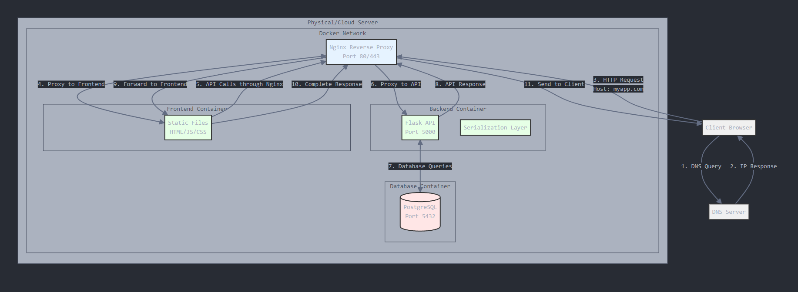
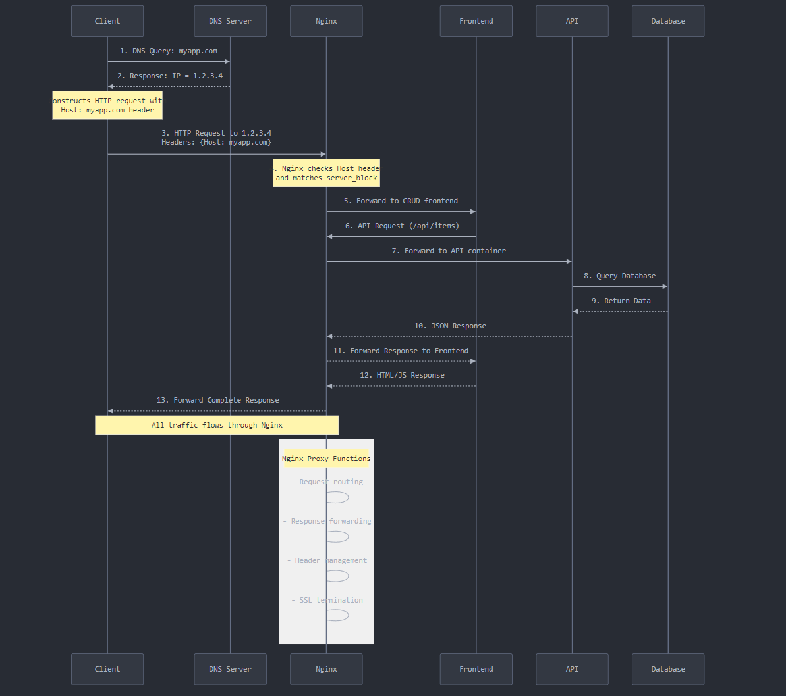

# restful-example

A lightweight CRUD (Create, Read, Update, Delete) application built with Python Flask backend and JavaScript/Bootstrap frontend.

## Diagrams
Example architecture and request/response flow diagrams for a RESTful application deployed to a server with reverse proxy.



## Features

- RESTful API backend using Flask
- Modern frontend using Bootstrap 5
- Simple file-based JSON storage
- Type-hinted Python code (Python 3.12)
- Cross-Origin Resource Sharing (CORS) enabled
- Bootstrap-styled responsive UI
- Toast notifications for user feedback
- Modal-based edit form

## Prerequisites

- Python 3.12 or higher
- Modern web browser
- Basic understanding of REST APIs

## Installation

1. Clone the repository:
```bash
git clone https://github.com/pietrykovsky/restful-example.git
cd restful-example
```

2. Create a virtual environment (optional but recommended):
```bash
python -m venv venv
source venv/bin/activate  # On Windows: venv\Scripts\activate
```

3. Install required Python packages:
```bash
pip install -r requirements.txt
```

## Running the Application

1. Start the backend server:
```bash
python api.py
```
The server will start at `http://localhost:8000`

2. Open `index.html` in your web browser
   - You can use a simple HTTP server if needed:
     ```bash
     python -m http.server 5000
     ```
     Then visit `http://localhost:5000/index.html`

## API Endpoints

| Method | Endpoint | Description |
|--------|----------|-------------|
| GET    | /api/items | Get all items |
| GET    | /api/items/<id> | Get a specific item |
| POST   | /api/items | Create a new item |
| PUT    | /api/items/<id> | Update an existing item |
| DELETE | /api/items/<id> | Delete an item |

### Request/Response Examples

#### Create Item (POST /api/items)
```json
// Request
{
    "name": "Example Item",
    "description": "This is an example item"
}

// Response
{
    "id": 1,
    "name": "Example Item",
    "description": "This is an example item"
}
```

## Data Storage

The application uses a simple JSON file (`items.json`) for data storage. In a production environment, this should be replaced with a proper database.

## Technical Details

### Backend
- Built with Flask
- Uses Python dataclasses for data serialization
- Implements proper type hints
- Follows PEP 8 style guidelines
- Uses HTTP status codes from `http.HTTPStatus`
- Implements safe ID generation for items

### Frontend
- Built with vanilla JavaScript
- Uses Bootstrap 5 for styling
- Implements modal forms for editing
- Features toast notifications
- Responsive design

## Development

To modify the application:

1. Backend changes:
   - Edit `api.py` to modify the API
   - Run the Flask application in debug mode for development

2. Frontend changes:
   - Modify `index.html` for layout changes
   - Edit `app.js` for functionality changes
   - No build step required

## Limitations

- Uses file-based storage (not suitable for production)
- No authentication/authorization
- Limited error handling
- No database integration
- Single-user application
